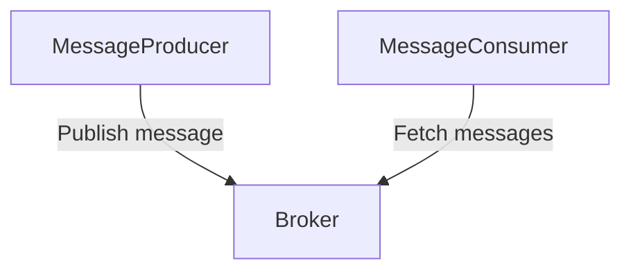
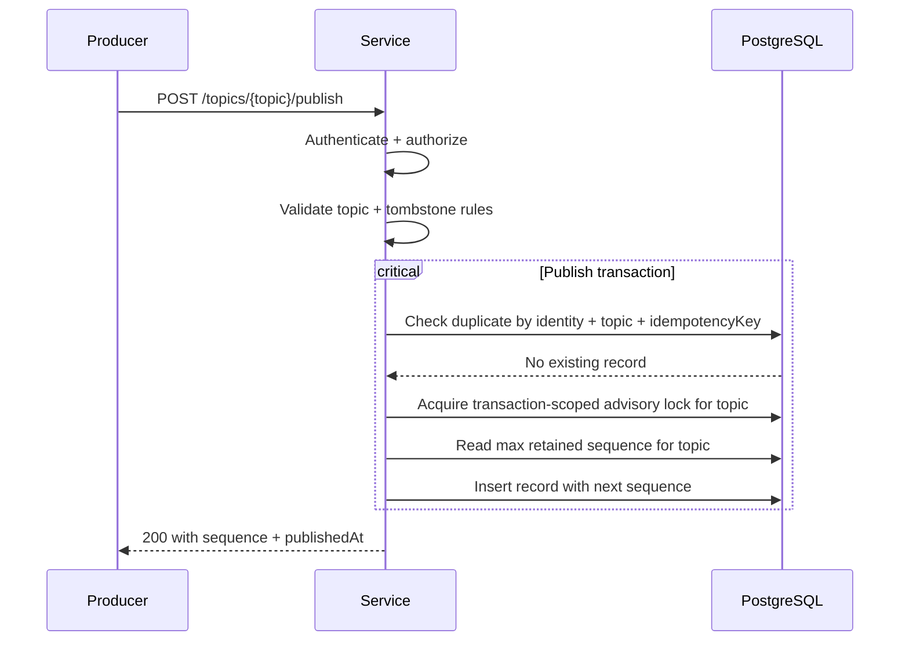
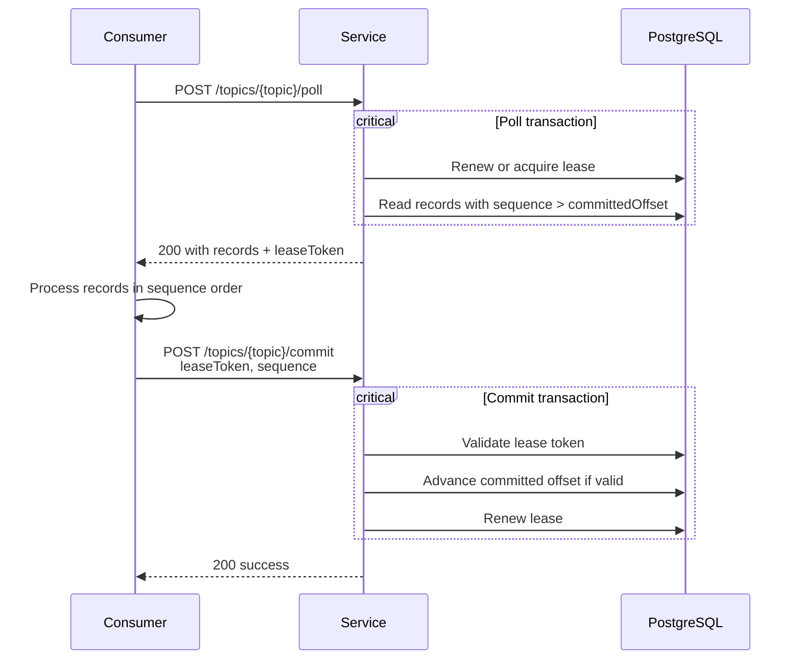
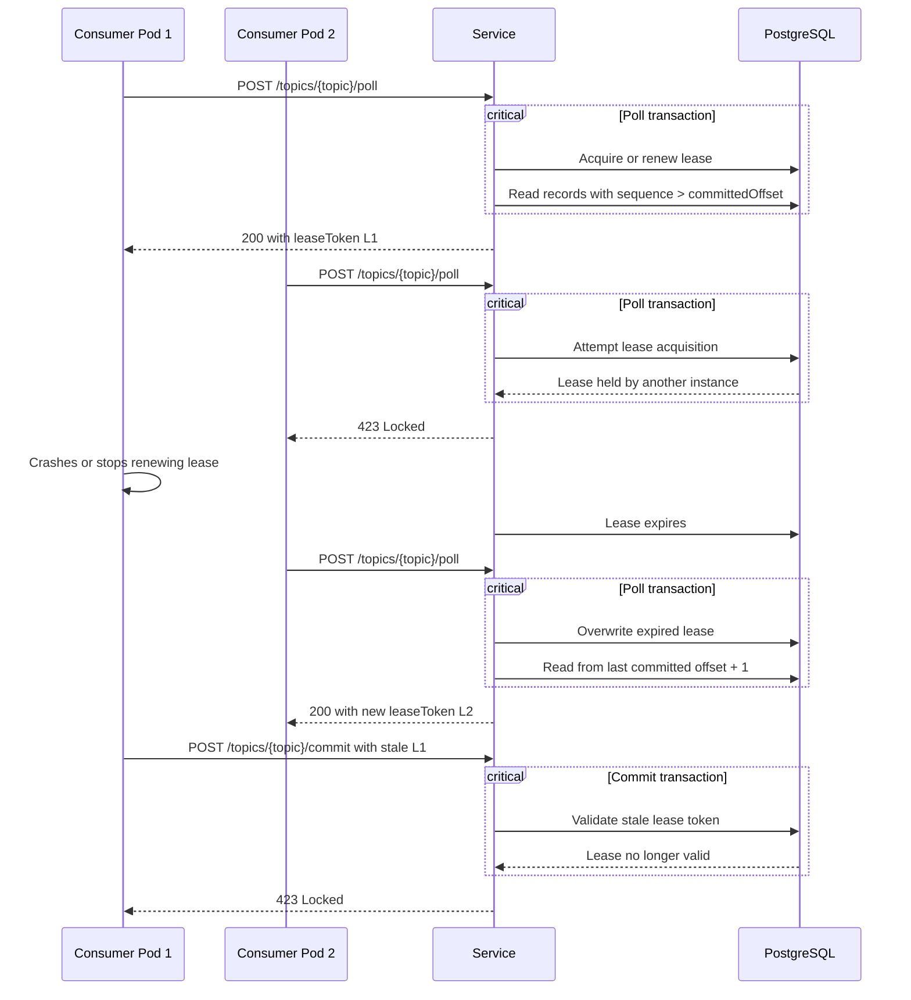

# matrikkel-kafka-light

Matrikkel-kafka-light is simplified [Apache Kafka](https://kafka.apache.org/) recreation. 
Created because a capability similar to what Kafka offers was needed, but no official support existed within the organization.

The applications and libraries in this project are created to make it easy to migrate to official Kafka on a later stage.
The API's are therefore quite similar, though several simplifications are done. E.g the project does not support partitions etc.


## Overview

The project consists of a broker application, and a client library. 



### The Broker
 
All **topics** are defined in the [TopicsCatalog](apps/broker/src/main/kotlin/no/kartverket/matrikkel/broker/config/Configuration.kt).

### Producing records

To produce records it is recommended to use the [MessageProducer](libs/client/src/main/kotlin/no/kartverket/matrikkel/kafkaclient/MessageProducer.kt).

```kotlin
val config = MessageProducer.Config(
    server = Url("http://server.url"),                  // URL to the broker
    topic = "my-topic",                                 // Topic for the records being produced
    keySerializer = StringSerde,                        // Serde for the record key
    valueSerializer = StringSerde,                      // Serde for the record payload
    correlationIdProvider = { "random correlationId" }, 
    bufferSize = 100,                                   // Number of records to buffer before forcing a publish call to the broker
    linger = 100.milliseconds,                          // Maximum amount of time to wait before a message is sent to the broker
    maxRetries = 5                                      // Retries if publishing fails
)

val producer = MessageProducer.Impl(config)

repeat(1000) { i ->
    producer.send(
        ProducerRecord(
            key = "key-${i}",
            value = "value-${i}"
        )
    )
}
```

`send` works asynchronously and will batch `bufferSize` of records, or wait `linger` before trying to publish records.
If, at any point, you need to know that a message has been sent successfully you can use the returned `CompletableDeferred<Unit>`.

```kotlin
val result = producer.send(
    ProducerRecord(
        key = "key-${i}",
        value = "value-${i}"
    )
)

result.invokeOnCompletion { error: Throwable? ->
    if (error == null) println("Message sent OK")
    else println("Message not sent: $error")
}
```



### Consuming records

To consume records it is recommended to use the [MessageConsumer](libs/client/src/main/kotlin/no/kartverket/matrikkel/kafkaclient/MessageConsumer.kt).

```kotlin
val config = MessageConsumer.Config(
    server = Url("http://server.url"),                  // URL to the broker
    topic = "my-topic",                                 // Topic for the records being produced
    keySerializer = StringSerde,                        // Serde for the record key
    valueSerializer = StringSerde,                      // Serde for the record payload
    correlationIdProvider = { "random correlationId" },
    maxRetries = 5,                                     // HTTP retries to poll/commit records
    consumerGroup = "test-group",                       // E.g the application name
    instanceId = "test-instance-id",                    // E.g the pod. Should be unique for each consumerGroup
    timeout = 10.seconds,                               // Amount of time to wait if the consumer does not have a active lease
    maxRecords = 100,                                   // Max number of records to retrieve in each request to the broker 
    initialOffsetPolicy = InitialOffsetPolicy.EARLIEST, // Sets initial offset for the consumerGroup if it hasnt already been set.
)

val consumer = MessageConsumer.Impl(config)

while (true) {
    val result: ConsumerRecords<String, String> = consumer.poll() // Supports overrides for `maxRecords` and `timeout`
    val records = result.records
    
    if (records.isEmpty()) {
        delay(10.seconds)
        continue
    }
    
    for (record in records) {
        println("Got record ${record.key} (${record.sequence}): ${record.value}")
    }
    
    consumer.commitSync()
}
```



If the lease is held by another instance from your consumers consumerGroup it will receive an http 423 Locked. 
This status-code is handled by the `MessageConsumer` itself. 



## Running locally
Starting the broker locally is done by running [RunLocally](apps/broker/src/test/kotlin/no/kartverket/matrikkel/broker/RunLocally.kt).
It supports two modes (decided by which `.env` file it loads);
- local-h2.env, if you only need an ephemeral database.
- local-postgres.env, if you are running PostgreSQL on you machine
- ~~local-compose.env (only used by docker-compose)~~

Additionally, you may start both the broker and PostgreSQL using `./gradlew apps:broker:build && docker compose up --build`